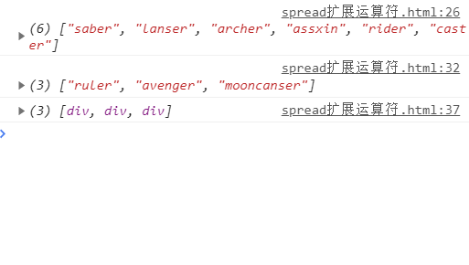
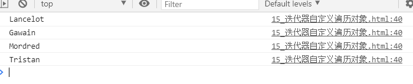

# ECMAScript6-11


# 第一章ECMAScript介绍

## 1、ECMAScript

**ECMAScript**是一种由[Ecma国际](https://baike.baidu.com/item/Ecma国际)（前身为[欧洲计算机制造商协会](https://baike.baidu.com/item/欧洲计算机制造商协会/2052072)，European Computer Manufacturers Association）通过ECMA-262标准化的脚本[程序设计语言](https://baike.baidu.com/item/程序设计语言)。这种语言在[万维网](https://baike.baidu.com/item/万维网)上应用广泛，它往往被称为[JavaScript](https://baike.baidu.com/item/JavaScript)或[JScript](https://baike.baidu.com/item/JScript)，所以它可以理解为是JavaScript的一个标准,但实际上后两者是ECMA-262标准的实现和扩展

所有的 Ecma 标准列表：http://www.ecma-international.org/publications/standards/Stnindex.htm

# 第二章ES6新特性

**ES6 的优点**

- ES6 的版本变动内容最多
- ES6 加入许多新的 **语法特性**，变成实现更简单、高效
- 前端发展趋势

兼容性：https://www.caniuse.com/?search=ES6

## 2.1、 let变量声明

- 变量声明 let 

  ​	特性：

  - 变量不能重复声明
  - 块级作用域生效 全局 函数 eval

  - 不存在变量提升；let 不允许 在声明他前 使用
  - 不影响作用域链


> `let练习`
>
> ```html
> <!DOCTYPE html>
> <html lang="en">
> <head>
>     <meta charset="UTF-8">
>     <meta name="viewport" content="width=device-width, initial-scale=1.0">
>     <title>let</title>
>     <style>
>         .item{
>             width: 100px;
>             height: 50px;
>             border: 1px solid pink;
>             margin: 20px;
>         }
>     </style>
> </head>
> <body>
>     <div class="container">
>         <h2 class="page-header">touch to change sytle</h2>
>         <div class="item"></div>
>         <div class="item"></div>
>         <div class="item"></div>
>     </div>
>     <script>
>         //获取元素
>       let items = document.getElementsByClassName("item")
> 
>       for(let i = 0; i<items.length;i++){
>           //切换元素style
>           items[i].onclick = function(){
>               items[i].style.background = 'pink'
>           }
>       }
> 
>       //使用var 声明变量 会使循环完成
>       // i=3 当点击div 时i=3 带入 div元素长度最大为2 使其越界 导致他找不到3 
>     </script>
> </body>
> </html>
> ```


1. 对应原本使用的 `var` 变量，因为没有 **块级作用域**，遍历的 3 次 for 循环的 3 次遍历 i 都会保存在 window 全局中
2. 通过 `let` 保存遍历，存在于对应的块级作用域中，当对应的 `onclick()` 事件触发时就会找到对应的块级作用域的变量 i

## 2.2、const 变量声明

变量声明const  声明常量  ；（java final）

```js
  const LADY = 'Reines';
```

- const注意事项

  - 1.一定要在声明时赋初始值 
  - 2.一般常量使用大写
  - 3.常量的值不能修改
  - 4.块级作用域  超出显示未定义
  - 5.对于数组和对象的元素修改，不算做对常量的修改，不会报错

  ```js
  const TEAM = ["Reines","waybo","hanhan"]
  TEAM.push("solomen")
  console.log(TEAM)
  ```


## 2.3、变量的解构赋值

*es6允许按照一定模式从数组和对象中提取值，对变量进行赋值*

*其中被称为解构赋值*

- 对数组的解构赋值

> ```js
>         const caster = ['gray','Reines','waybo'];
>         let [g,r,w] = caster
>     
>         console.log(g);
>         console.log(r);
>         console.log(w);
> ```

- 对对象的解构赋值

> ```js
>         //对象的解构
>         const elMello ={
>             name:'Reines',
>             age:'unknown',
>             lord: function(){
>                 console.log("waybo");
>             }
>         };
> 
>         let {name, age, lord} = elMello;
>         console.log(name);
>         console.log(age);
>         console.log(lord);
> 
>     
>         lord();
> ```


## 2.4、模板字符串

​		es6 引入新的声明字符串的方式 **` `` `**

- 声明

```js
        //1、声明
        let str = `new String`;
        console.log(str, typeof str);
```

`tips：`

- 可以在`` 中出现换行符
- 可以进行变量拼接

```js

        //3. 变量拼接
        let name = 'waybo';
        let show = `${name} lord elmello ni sei`
        console.log(show);
```

> 结果为：
>
> ```js
>  waybo lord elmello ni sei
> ```

## 2.5、简化对象写法

ES6允许在大括号里，直接写入变量和函数，作为对象的属性和方法 ，熟悉更加简洁

```js
let name = "Reines";
let elMello = function(){
    console.log('lord');
}

const school = {
    name,
    elMello, //变量使用
    improve(){// 方法简写
        console.log('简便写法');
    }
}
console.log(school);
```

> console.log(school); 
>
> 打印结果

```
{name: "Reines", elMello: ƒ, improve: ƒ}
```


tips:

```js
improve(){// 方法简写
        console.log('简便写法');
    }
```

原：

```js
improve = function(){// 方法简写
        console.log('简便写法');
    }
```


## 2.6、箭头函数 =>

### 2.6.1 箭头函数的使用

ES6允许使用箭头 （=>） 定义函数

```js
let fn = () => {
    console.log('=>函数');
}
fn();
```

> - *this 是静态的   ; this 始终指向函数声明时所在作用域下的 this 的值*
>
> ```js
>         function getName(){
>             console.log(this.name);
>         }
> 
>         let getName2 = () =>{
>             console.log(this.name);
>         }
>         //设置window 对象name 属性
>         window.name = "Reines";
>         const teacher = {
>             name:'waybo'
>         };
> 
>         // call() 方法调用
>         getName.call(teacher)//waybo
>         getName2.call(teacher);//Reines
> ```
>
> 
>
> - 2.不能作为构造实例化对象
>
> ```js
>         let Person = (name,age) => {
>             this.name = name;
>             this.age = age
>         }
>         ;//构造方法找不到
> ```
>
> - 3.不能使用 arguments 变量
>
> ```js
>         let args = () =>{
>             console.log(arguments);
>         }
> 
>         args(1,2,3)
> ```
>
> Uncaught ReferenceError: arguments is not defined
>
> - 4.箭头函数简写
>
> ```js
> // 1)省略小括号 ，当形参只有一个的时候
> // 2)省略花括号。当代码体只有一句时 此时return必须省略
> let test = n => n + n;
> ```


### 2.6.2 箭头函数实践

```html
    <style>
        div{
            width: 200px;
            height: 200px;
            background: #0ff;
        }
    </style>
</head>
<body>
    <div id="ad"></div>
    <script>
        //获取·元素
        let ad = document.getElementById('ad')
        //事件
        ad.addEventListener('click',function(){
            // this 为静态的 会指向在声明时所在作用域下this 的值
            setTimeout(()=>{
            
                this.style.background = "pink";
            },1000)
        })
        
        //返回 数组中偶数的元素
        const arr = [1,6,4,23,100]
        
        const result = arr.filter(item => item % 2 === 0)

        console.log(result);
        //箭头函数适合 与this 无关的回调 定时器 数组的方法回调
        //不适合  与this 有关的回调 事件回调 对象的方法；
        // 因为 this 不会指向当前作用域的元素 而是指向作用域外的元素


    </script>
</body>
```


- 当定时器不使用箭头函数

```js
    ad.addEventListener('click',function(){
        // this 为静态的 会指向在声明时所在作用域下this 的值
        setTimeout(function(){
        
            this.style.background = "pink";
        },1000)
    })

//Uncaught TypeError: Cannot set property 'background' of undefined
```
> this不会指向外部作用域的元素 从而找到当前作用域元素值 


- 箭头函数适合 与this 无关的回调 定时器 数组的方法回调
- 不适合  与this 有关的回调 事件回调 对象的方法；
  因为 this 不会指向当前作用域的元素 而是指向作用域外的元素


## 2.7.参数默认值

es6允许给函数参数赋值初始值


- 1. 形参初始值 具有默认值参数 ，一般位置要靠后 

```js
  function add(a,b,c){
            return a + b + c;
        }
        let result = add(1,2,3);
        console.log(result);

```

**tips**:

> 当传参数时有参数未传入 ，可以给参数设置默认值

```js
  function add(a,b,c=10){
            return a + b + c;
        }
        let result = add(1,2);
        console.log(result);
```

结果为13

注意：设置默认值得参数 一般位置要靠后 否则会NaN


-  2.与解构赋值结合

```js
        function connect({host,userName,password,port=3308}){
            console.log(host);
            console.log(userName);
            console.log(password);
            console.log(port);
        }
        connect({
            host :'localhost',
            userName: 'root',
            password: 'root',
            //port: 3306
        })
```


## 2.8.rest 参数

es6引用rest 参数 用于获取函数的实参 ，用来代替arguments

- 在es5获取实参的方式

```
        function date(){
            console.log(arguments);
        }
        date('Reines',"waybo",'saber')
```

> 得出的结果为  一个object 的对象

- 使用rest 参数

```js
        function date2(...args){
            console.log(args);
        }
        date2('Reines',"waybo",'saber')
```

> 结果 会得出一个 数组


**tips：**

- rest 参数必须要放在最后

```js
function fn(a,b,...args){
    console.log(a);
    console.log(b);
    console.log(args);
}
fn(1,3,4,5,6,7,)
```

得出的结果为

> 1
> 3
> (4) [4, 5, 6, 7]

第一第二个值 会赋值给ab 后面的放在args 中 用作数组

、


## 2.9、spread 扩展运算符

扩展运算符 ... 能将 数组 转换为逗号分隔的 参数序列

```js
        //数组 
        const ccc = ['bb','moon','canser']

        function MoonCanser(){
            console.log(arguments);
        }
        MoonCanser(ccc);
```

得出一个arguments 数组


使用扩展运算符

> ```js
>         MoonCanser(...ccc);
> ```

转换为逗号分隔的 参数序列


### `应用`：

#### 2.9.1.添加数组

```js
 const upthree = ['saber','lanser','archer']
        const downthree = ['assxin','rider','caster']
        const fate = [...upthree,...downthree]
        //相当于 ['saber','lanser','archer'  , 'assxin','rider','caster']
        console.log(fate);
```

...把数组展开 放进数组

> (6) ["saber", "lanser", "archer", "assxin", "rider", "caster"]

#### 2.9.2.数组的克隆

```js
//2.数组的克隆
const special = ['ruler','avenger','mooncanser']

const clone = [...special]
console.log(clone);
```

clone 数组


#### 2.9.3.将伪数组转换为真正的数组

```html
<div></div>
<div></div>
<div></div>
<script>
    const divs = document.querySelectorAll('div');
    const divArr = [...divs]
    console.log(divArr);
</script>
```



## 2.10、symbol 

### 2.10.1 symbol 数据的创建

es6引入了一种新的原始数据Symbol 表示独一无二的值，它是js语言的第七种数据类型 是一种 类似于字符串的数据类型

> Symbol特点：
>
> - symbol的值是唯一的，用来解决命名冲突的问题
> - symbol值不能与其他数据进行运算
> - symbol 定义的对象属性 不能使用for... in 循环遍历。但是可以使用Reflect.ownKeys来获取对象的所有键名

symbol**两种创建方式**：

- 方式一：
  Symbol('') 创建 ，通过其创建的数据 即使写入的字符串相同，其值也不相同

- 方式二：

  symbol.for() 创建， 通过其创建的数据可以使传入的字符串值相同 

```js
let e = Symbol('Reines');//可以传入一个值，作为描述字符串(注释)
let e2 = Symbol('BYQ'); 
console.log(e === e2); //false 其值不相同
console.log(e,typeof e);//Symbol('Reines') "symbol"
// Symbol 是唯一的 
// 如果希望重新使用同一个symbol值

// 可以使用 symbol.for
let a1 = Symbol.for('Reines');
let a2 = Symbol.for('Reines');
console.log(a1 === a2);//true 

//不能与其他数据进行运算，对比
// let result = s + 100
// let result = s + s
```


`tips`:

> 7种数据类型：
>
> USONB
>
> - U ：undefined 
> - S ：String，Symbol
> - O：object
> - N：null，Number
> - B：boolean


### 2.10.2 symbol创建对象属性

- #### 扩展原对象 属性和方法

```js
//扩展原对象的 属性和方法
// 向对象添加方法 up down
let game = {
    name: "onmyoji",
    // up: function(){
    //     console.log('game.up()');
    // },
    // down: function(){
    //     console.log('game.down()');
    // }
}
// 声明一个对象
let methods = {
    up: Symbol(),
    down:Symbol()
}
// 使用对象[symbol数据] 来添加 方法，属性
game[methods.up] = function(){
    console.log("method.up()");
}
game[methods.down] = function(){
    console.log("method.down()");
}
// console.log(game);
```

- #### *声明 对象时定义symbol类型的数据*

```js
 //声明 对象时定义symbol类型的数据
let exam = {
    name: 'Eleina',
    //因为symbol 是表达式 所以需要加上[]
    [Symbol('say')]: function(){
        console.log('call my name');
    },
    //方法简写
    [Symbol('level')]: () => {
        console.log('魔女');
    },
    [Symbol('ps')]: 'cute'
}
console.log(exam);
```


### 2.10.3 symbol内置值

除了定义自己使用的 Symbol 值以外，ES6 还提供了 11 个内置的 Symbol 值，指向语言内部使用的方法。

| 内置Symbol的值            | `调用时机`                                                   |
| ------------------------- | ------------------------------------------------------------ |
| Symbol.hasInstance        | 当其他对象使用 instanceof 运算符，判断是否为该对象的实例时，会调用这个方法 |
| Symbol.isConcatSpreadable | 对象的 Symbol.isConcatSpreadable 属性等于的是一个布尔值，表示该对象用于 Array.prototype.concat()时，是否可以展开。 |
| Symbol.species            | 创建衍生对象时，会使用该属性                                 |
| Symbol.match              | 当执行 str.match(myObject) 时，如果该属性存在，会调用它，返回该方法的返回值。 |
| Symbol.replace            | 当该对象被 str.replace(myObject)方法调用时，会返回该方法的返回值。 |
| Symbol.search             | 当该对象被 str. search (myObject)方法调用时，会返回该方法的返回值。 |
| Symbol.split              | 当该对象被 str. split (myObject)方法调用时，会返回该方法的返回值。 |
| Symbol.iterator           | 对象进行 for…of 循环时，会调用 Symbol.iterator 方法，返回该对象的默认遍历器 |
| Symbol.toPrimitive        | 该对象被转为原始类型的值时，会调用这个方法，返回该对象对应的原始类型值。 |
| Symbol. toStringTag       | 在该对象上面调用 toString 方法时，返回该方法的返回值         |
| Symbol. unscopables       | 该对象指定了使用 with 关键字时，哪些属性会被 with环境排除。  |

> 对象 可以通过对应方法来触发symbol内置值
>
> 也可以使用[symbol.内置值] 设置对应属性

```js
// 1、hasInstance 
class Person{
    //当进行instanceof 会自动执行该方法
    static [Symbol.hasInstance](param){
        console.log(param);
        console.log("检测");
        return true;
    }
}
let o = {
    name: 'Reines'
}
console.log(o instanceof Person);

// 2.symbol.isConcatSpreadable，
// 表示该对象用于 Array.prototype.concat()时，是否可以展开。
const arr = ['1','2','3']
const arr2 = ['4','5','6']
arr2[Symbol.isConcatSpreadable] = false//设置为false表示不展开加入数组arr

console.log(arr.concat(arr2));
//结果 ["1", "2", "3", Array(3)]
```


## 2.11. 迭代器

迭代器( iterator )是一种接口，为各种不同的数据结构提供统一的访问机制，任何数据结构只要部署 iterator 接口，就可以完成遍历操作。

> iterator 接口 对象的一个属性 这里指symbol.iterotar内置值

- ES6 创造了一种新的遍历命令 for...of 循环，iterator 接口主要供 for...of 消费

- 原生具备iterator 接口的数据（可用for of 遍历）
  - Array
  - Arguments
  - Set
  - Map
  - String
  - TypedArray
  - NodeList

```js
// 声明一个数组
const titan = ["allen","Reiner","Armin",'mikasa'];
// for... of 遍历数组输出  保存的是键值
//for ... in 循环保存的是键名
// for(let v in titan){ //0,1,2,3
for(let v of titan){
    console.log(v);//输出数组元素
}
```

- 工作原理

  - 创建一个指针对象，指向当前数据结构的起始位置
  - 第一次调用对象的next方法，指针会指向数据结构的第一个成员
  - 接下来不断调用next 方法，指针一直往后移动，直到指向最后一个成员
  - 每次调用next方法返回一个包含value 和done属性的对象

  vlaue ：数据

  done：遍历是否完成的状态，直到最后一个成员返回done的状态会变成true ，未完成则是false

```js
//1.创建一个对象获取symbol的迭代器
let iterator = titan[Symbol.iterator]();

//2.调用对象的next（）方法
console.log(iterator.next());//{value: " ", done: false}
console.log(iterator.next());//指向下一个值
console.log(iterator.next());
console.log(iterator.next());
//3.不断调用对象的 next() 方法，指针一直向后移动，直到最后一个成员
console.log(iterator.next());//{value: undefined, done: true}
```


#### 自定义迭代器

`迭代器练习`：

```js
 // 声明一个对象
const knight = {
    name:'Round Table',
    status:[
        'Lancelot',
        'Gawain',
        'Mordred',
        'Tristan'
    ],
    [Symbol.iterator](){
        // 索引变量
        let index = 0;
        // let _this = this;
        return {
            next:() =>{
                if(index < this.status.length){
                    const result = {value: this.status[index], done: false};
                    // 下标自增
                    index++;
                    // 返回结果集
                    return result;
                }else{
                    return{value: undefined, done: true}
                }
            }
        };
    }
}
for(let v of knight){
    console.log(v);
    //
}
```

> 以自定义的方式 用迭代器遍历对象数组
>
> 
>
> - 注意此处的this 指的是  next: function() {  
> - 所以需要使用箭头函数或者是 // let    _this = this;
>
> ```js
> [Symbol.iterator](){
>     // 索引变量
>     let index = 0;
>     // let _this = this;
>     return {
>         next:() =>{
>             if(index < this.status.length){
>                 const result = {value: this.status[index], done: false};
>                 // 下标自增
>                 index++;
>                 // 返回结果集
>                 return result;
>             }else{
>                 return{value: undefined, done: true}
>             }
>         }
>     };
> }
> ```

**输出结果：**

